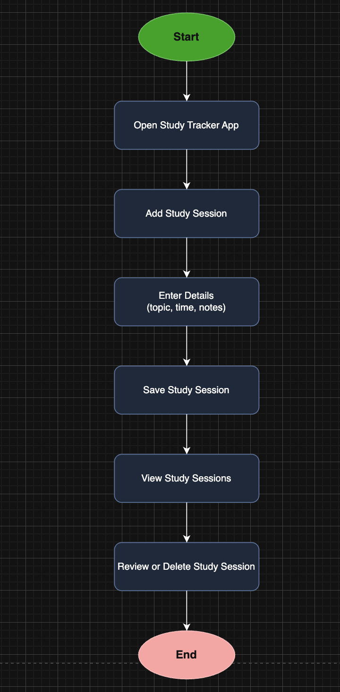
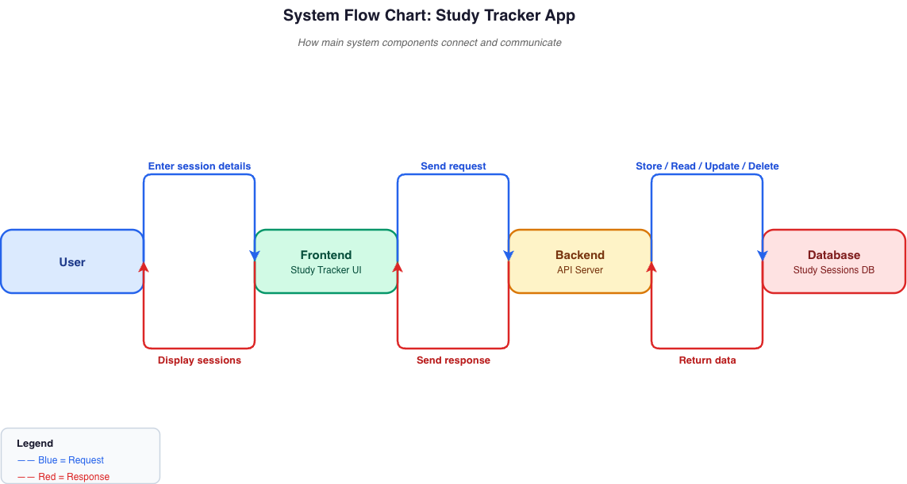
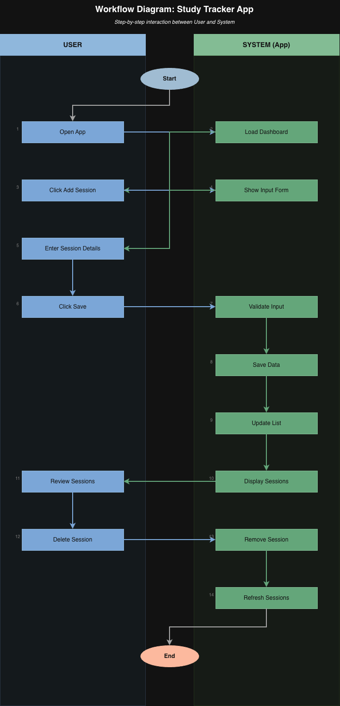
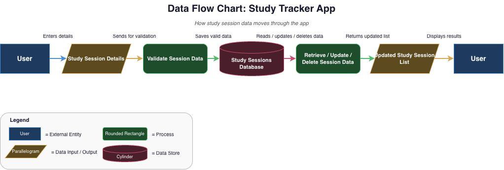
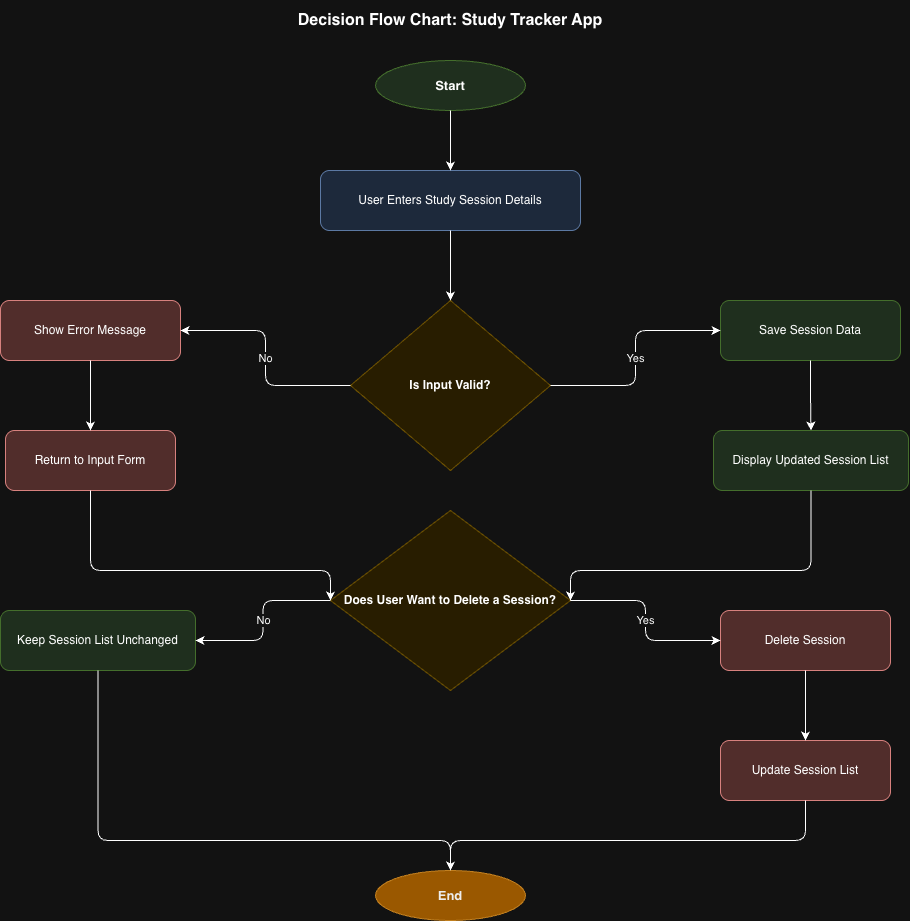
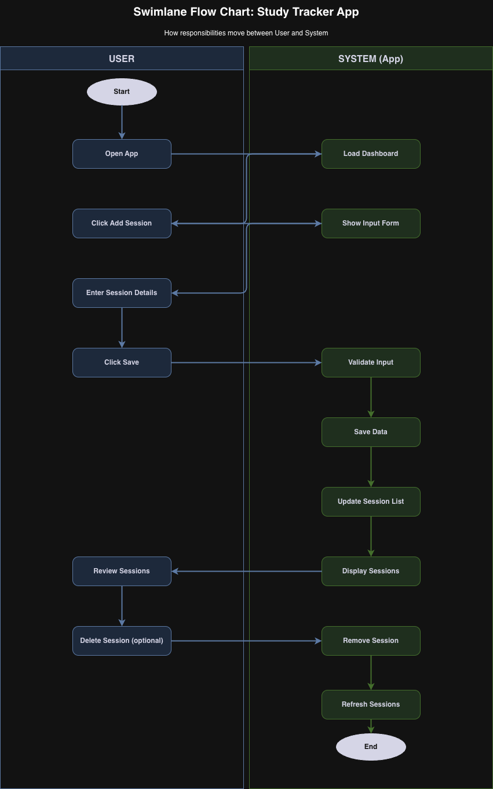

# StudyWave

A simple study session tracker that runs in the browser. No login, no backend, just a clean way to log what you studied and see your progress over time.

---

## Why I Made This

I wanted a lightweight tool to track my own study sessions while learning web development. Most apps I found were either too complex or required an account. I built this as a frontend practice project and tried to keep it as simple as possible.

---

## Features

- Log study sessions with a topic, date, duration, and optional notes
- Dashboard with recent sessions and quick stats
- View all sessions with topic filters
- Stats page with a breakdown of hours per topic
- Delete sessions from anywhere in the app
- All data saved to localStorage so it persists between visits
- Responsive layout that works on mobile

---

## Topics Supported

JavaScript, React, SQL, Python, Node.js

---

## Tech Stack

- HTML, CSS, JavaScript (no frameworks, no libraries)
- localStorage for data storage
- Figma for UI design

---

## How to Run

No installation needed. Just open `index.html` in your browser.

```
git clone https://github.com/koki-star/studywave-app.git
cd studywave-app
open index.html
```

Or drag the `index.html` file into any browser window.

---

## What I Learned

- Building a full UI with vanilla JavaScript
- Managing state with localStorage
- Writing modular, readable JS without a framework
- Designing in Figma before writing code
- Keeping a project organized without build tools

---

---

## Diagrams

For this project, I created different types of flow charts to show how the app works from different perspectives.

### Basic Flow Chart


### System Flow Chart


### Workflow Diagram


### Data Flow Chart


### Decision Flow Chart


### Swimlane Flow Chart


---

## Future Improvements

- Add more topics
- Let users create custom topics
- Add a weekly or monthly summary view
- Export sessions to CSV
- Add a dark mode

---

## Author

Kokob
